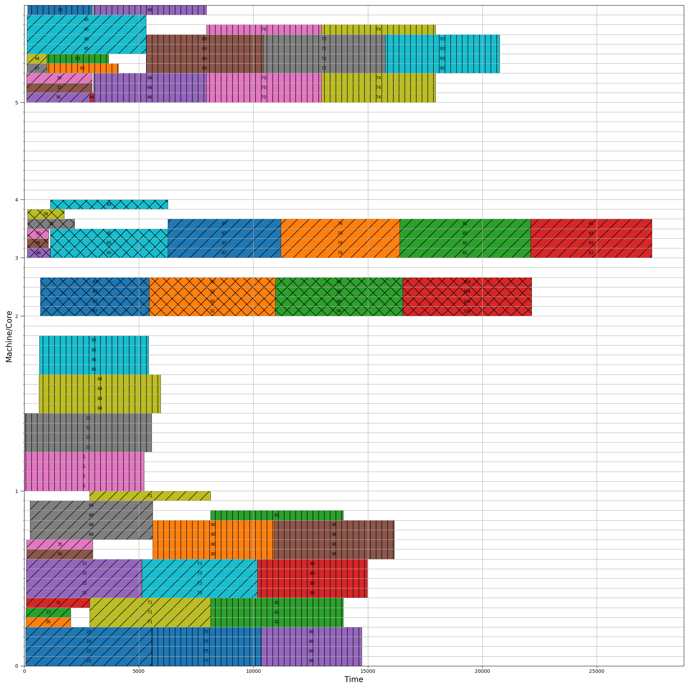

# Scheduling Cores Gantt
Some simulators (e.g., [Batsim](https://batsim.frama.io/), [Simgrid](https://simgrid.org/), or your own simulation) ignore the exact core allocation since this is OS's responsibility. However, it is nice to visualize the allocation by core. 

This project takes a simple input to create a Gantt graph by machine cores. It will take a first-fit approach given the available cores at the step given in the input file.

# Input file

The input file is a simple JSON, that can be created by a simple script. A JSON input example is:

```json
{
    "machines": {
        "0": {
            "cores": 18
        }
    },
    "jobs": {
        "23": {
            "start_time": 56,
            "finish_time": 5559,
            "machine": 0,
            "cores": 4
        }
    },
    "config": {
        "min_time": 0,
        "max_time": 28800
    }
}
```

This file is divided into three big groups: *machines*, *jobs*, and *config*. 

*machines* group gives the configuration of each machine in the scheduling. Right now, the only configuration is the number of cores (*cores*). The key (in the example "0") is unique.

*jobs* group is the result of each scheduled job. The key (in the example "23") is unique. The job group contains:
- starting time ("start_time")
- finished time ("finish_time")
- selected machine ("machine")
- number of cores demanded by the job ("cores"). **It is important to notice that the input gives only how many cores the job needs and the script chooses them.**

Finally, we introduce a configuration group to set the simulation begin and end.

# Installing
The following command creates a conda environment.

```
conda env create -f environment.yml
```

# Usage

First, activate your environment with:

```
conda activate gantt
```

Then, you can execute the help command to see the options:

```
python gantt.py -h
usage: gantt.py [-h] -f FILE [-s FILE]

options:
  -h, --help            show this help message and exit
  -f FILE, --file FILE  Input file to evaluate
  -s FILE, --save FILE  Output file
```

# Example
The following command outputs the Gantt result:

```
python gantt.py -f example/scheduling.JSON
```

The expected Gantt is:


You can also directly save this file using:

```
python gantt.py -f example/scheduling.JSON -s example/scheduling.png
```